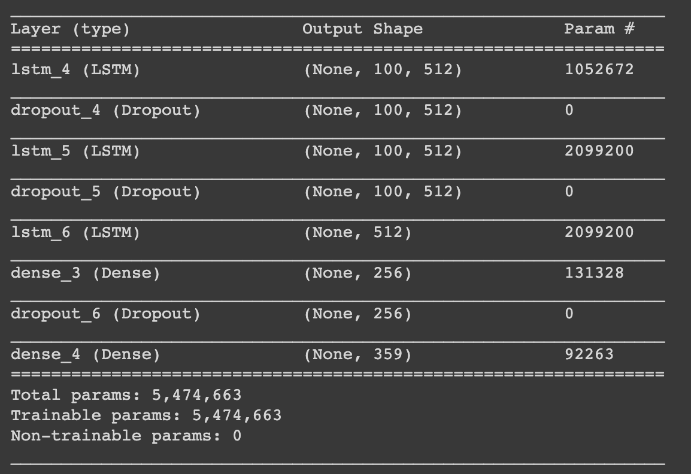
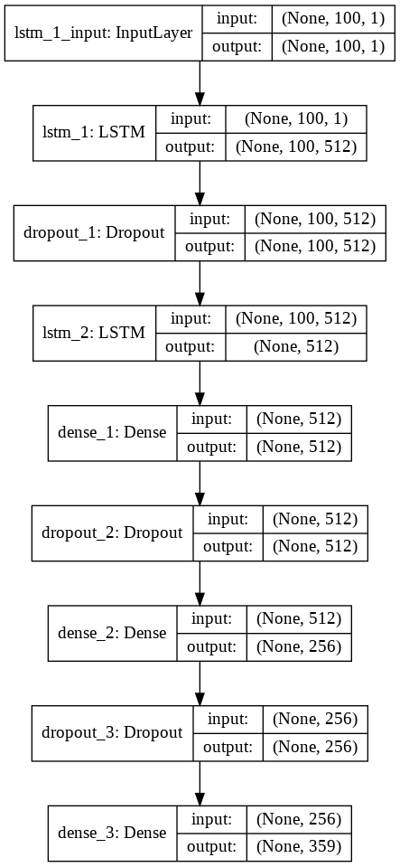

<h1>AI Music Generator</h1>

This is a Deep Learning & Natural Language Processing model which can generate Piano Music

<h2 id="intro">Introduction</h2>

The usage of Neural Networks has been steadily increasing over time. With a multitude of papers being published every year on this subject, Deep Learning has found its applications in many fields of our daily lives - ranging from recommedation systems and personalization to medical diagnosis and healthcare. A recently popularised area of applying these techniques is for content generation.
 
Text Generation, the most commonly seen form of this has become a ubiquitous feature in recent years. Auto-complete features in our message apps, emails and even Google searches is a common and helpful application of these methods. The model on the backend inputs and processes the few words typed by us and predicts the next most probable word from its vocabulary. The user has an option to use this word or continue typing, either of which further trains the algorithm as the model learns from the actual next word.
 
An attempt along a similar philosophy can be made to train a neural network to generate music, and this is indeed becoming popular in recent years. Here I build a Long-Short Term Memory (LSTM) neural network in Python using Keras, to generate piano music.

<h2 id="dataset"> Dataset </h2>

The dataset (contained in the /songs directory) consists of around 90 MIDI (Musical Instrument Digital Interface) audio files. Each of these files is a couple of minutes in duration and consists of piano music. Most of these files contain music from the Final Fantasy series of games, since the music is very distinct and has beautiful melodies. For playing the music of a file, follow the steps in <a href="#usage">Usage</a> section below.

<h2 id="model">Model</h2>
    

    <figure>
        
        <figcaption> Summary of the model </figcaption>
    </figure>
    

    

    I built an LSTM model using Keras Sequential API, which inputs sequences (of notes) of fixed length, and learns to predict the next note in the sequence. A summary of the model and a plot of its layers in given below -
    

    

    <figure>
        
        <figcaption> A plot of the model and its layers </figcaption>
    </figure>
    

